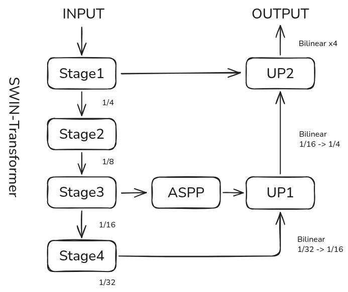

# SwinASPPNet: Robust Semantic Segmentation for Autonomous Driving
This repository implements SwinASPPNet, a hybrid architecture combining the powerful global context of Swin Transformer with the multi-scale capabilities of DeepLabV3+ (ASPP).

Designed specifically for high-resolution autonomous driving scenes (Cityscapes), this project features advanced engineering optimizations to enable training large models (e.g., Swin-Large) on limited GPU resources.

---
### 🌟 Key Features
Hybrid Architecture: Uses Swin Transformer (Tiny/Small/Base/Large) as the encoder and a DeepLabV3+ style ASPP decoder.

Low VRAM Optimization:

Replaced all BatchNorm with GroupNorm, allowing stable training even with Batch Size = 1.

Supports Mixed Precision Training (AMP) for faster convergence.

Advanced Training Strategies:

Differential Learning Rates: 0.1x LR for the pretrained backbone, 1.0x LR for the decoder head.

Multi-scale Training: Random scaling (0.5x ~ 2.0x) and cropping during training.

Cosine Annealing with Warm Restarts: Prevents getting stuck in local minima.

Production-Ready Inference: Supports full-image evaluation via dynamic resizing (512x1024) and bilinear upsampling.

---
### 🧠 Model Arichitecture



---
### 📂 Project Structure

```
SwinASPPNet-Seg/
├── checkpoints/       # Saved models and logs
├── models/
│   ├── blocks.py      # Basic blocks (DoubleConv, Up, ASPP) with GroupNorm
│   └── swin_aspp_net.py # Main Architecture
├── utils/
│   ├── dataset.py     # Cityscapes dataset with Multi-scale Augmentation
│   ├── loss.py        # CrossEntropy with Class Weights
│   ├── metrics.py     # mIoU calculation
│   ├── logger.py      # CSV Logger
│   └── plot.py        # Training visualization
├── config.py          # Hyperparameters configuration
├── train.py           # Main training script
├── predict.py         # Inference and visualization script
└── README.md
```

---
### 🛠️ Installation
Clone the repository

Bash

git clone https://github.com/YourUsername/SwinASPPNet-Seg.git
cd SwinASPPNet-Seg
Install dependencies

```bash
pip install torch torchvision timm tqdm matplotlib pandas opencv-python
```

Prepare Dataset (Cityscapes) Organize your dataset as follows:

The model expects a flat directory structure. We provide a helper script `preprocess_cityscapes.py` to convert the standard Cityscapes dataset (nested folders) into the required format.

**Prerequisite:** Ensure you have generated `labelTrainIds` using the official Cityscapes scripts (`csCreateTrainIdLabelImgs`).

1. **Configure Paths**: 
   Open `preprocess_cityscapes.py` and set your `SOURCE_ROOT` (where you downloaded Cityscapes) and `TARGET_ROOT`.

2. **Run Preprocessing**:

```bash
python preprocess_cityscapes.py
```

```
Datasets/Cityscapes_Flat/
├── images/
│   ├── train/    # .png images
│   └── val/
└── masks/
    ├── train/    # .png masks (labelIds or trainIds)
    └── val/
```

Update the paths in config.py accordingly.

---
### 🚀 Usage
1. Training
To train the model. You can switch backbones (Tiny -> Large) in config.py.

```bash
python train.py
```

Configuration: Modify config.py to change MODEL_IDX (Backbone), BATCH_SIZE, or LR.
Monitoring: Training curves (Loss/mIoU) are saved to checkpoints/ automatically.

2. Inference (Testing)
To run inference on a folder of test images and visualize the results (blended masks).

```bash
python predict.py
```

Input: Place test images in test_data/.

Output: Results will be saved to test_results/.

Mechanism: The script resizes input images to 512x1024 for inference and upsamples the prediction back to the original resolution for high-quality results.

---
### 📊 Performance Notes
Backbone: Swin-Large (Window 12, 384)
Training Size: 512x512 (Random Crop & Scale)
Inference Size: 512x1024
Optimizer: AdamW with Cosine Annealing Warm Restarts (T_0=10, T_mult=2).

---
### 🤝 Reference
- [Swin Transformer](https://arxiv.org/pdf/2103.14030)
- [DeepLabV3+](https://github.com/VainF/DeepLabV3Plus-Pytorch)
